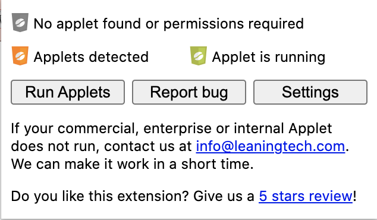
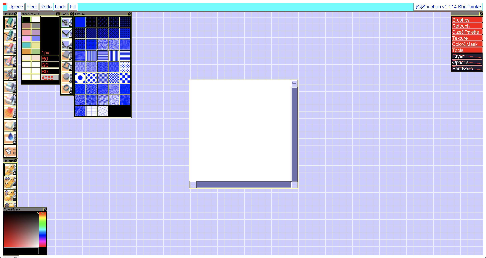

# Run Shi-Painter Pro Locally with Chrome

1. Download the [CheerpJ Applet Runner](https://chrome.google.com/webstore/detail/cheerpj-applet-runner/bbmolahhldcbngedljfadjlognfaaein/related) Chrome extension
    * This allows you to run Java applets without installing Java (cray-cray!)
    * Only works with a web server (can't just open an HTML file). More on this later.
2. Download [`sptr1114.zip`](http://hp.vector.co.jp/authors/VA016309/spainter/index_en.html) and extract the `.zip` file.
    * Or go to `sptr114/` directory in a local copy of this repository
3. Download Python so that we can start a web server. More on this [here](https://developer.mozilla.org/en-US/docs/Learn/Common_questions/set_up_a_local_testing_server#running_a_simple_local_http_server).
4. Go to `sptr1114/` and start a web server (in Terminal):
```
cd sptr1114
python3 -m http.server
```

This will start a web server listening at `localhost:8000`.

5. Go to `http://localhost:8000/spainter_pro.html` in Chrome
6. Click on the `CheerpJ` Chrome Extension icon at the top right (icon should be orange)
    * `Applets detected` should be enabled (orange icon).


7. Click `Run Applets`. You should see the (nostalgic) Shi-painter Pro app!


## Sources
* [しぃペインターをGoogle Chromeで使う](https://note.com/satopian/n/n38e9e269d329#TPSao)
